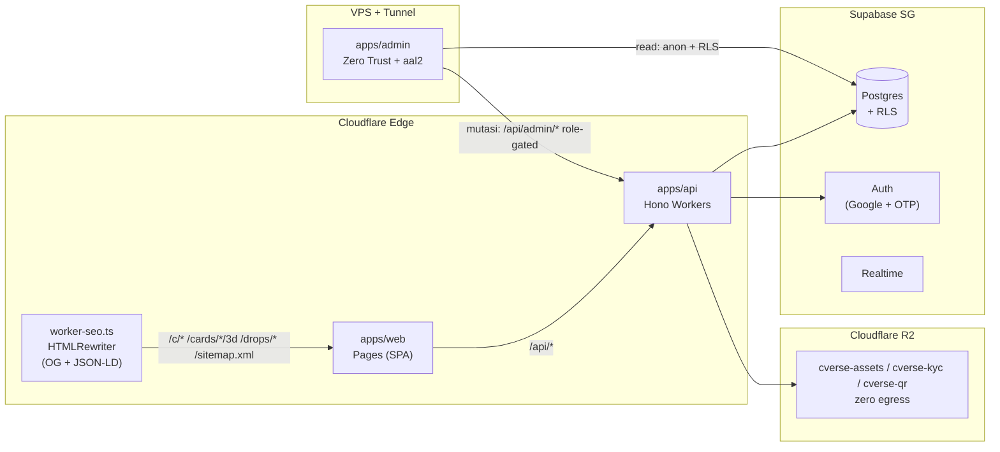

# C.Verse Platform — C.Card MVP

> **Creator Verse** — platform kartu koleksi kreator edisi terbatas (63×88mm, holo, acrylic, NTAG 424 TagTamper). Satu harga, satu kartu per orang, vault-first, provenance NFC.

[](#stack)
[](#angka-kunci)
[](#dokumen-canonical)
[](#prasyarat)

---

## Daftar Isi

- [Arsitektur](#arsitektur)
- [Quick Start](#quick-start)
- [Struktur Monorepo](#struktur-monorepo)
- [Fitur Inti](#fitur-inti)
- [Halaman & Route](#halaman--route)
- [C-Coin & Ekonomi](#c-coin--ekonomi)
- [Keamanan & Anti-Fraud](#keamanan--anti-fraud)
- [Deployment](#deployment)
- [Dokumen Canonical](#dokumen-canonical)
- [Konvensi](#konvensi)

---

## Arsitektur



- **Web publik** → Cloudflare Pages. SEO tanpa SSR: satu Worker di depan SPA inject `og:*` + `JSON-LD` dan mem-proxy `sitemap.xml` dari `apps/api/src/routes/seo.ts`.
- **API** → Hono di Workers (lokal via `@hono/node-server`). Supabase wajib — tanpa `SUPABASE_URL` API mati keras di startup (`src/index.ts:27`), tidak ada mode in-memory. Storage R2 disiapkan di `wrangler.toml` (binding masih dikomentari sampai bucket dibuat).
- **Admin** → Vite SPA terpisah di VPS + Cloudflare Tunnel + Access. Baca lewat anon key + RLS policy admin; **semua mutasi** lewat `/api/admin/*` role-gated supaya ter-audit. 2FA TOTP (`aal2`) wajib, audit log append-only.

---

## Quick Start

### Prasyarat

| Tool | Versi |
|------|-------|
| Node | `>=20` |
| pnpm | `9.12.3` (`npm i -g pnpm@9.12.3`) |

> Jangan pakai `npm`/`yarn` — lockfile `pnpm-lock.yaml` v9.

### Install & Jalan

```bash
pnpm install

# Semua service (API :8787 + Web :5173)
pnpm dev

# Per app
pnpm --filter @c-verse/api dev:node   # Hono Node :8787
pnpm --filter @c-verse/api dev        # wrangler dev :8787 (Workers runtime)
pnpm --filter @c-verse/web dev        # Vite :5173  (proxy /api → :8787)
pnpm --filter @c-verse/admin dev      # Vite :3000  (127.0.0.1 only)

# Quality gates (urut — semua harus hijau sebelum commit)
pnpm run format      # biome auto-format
pnpm run lint:fix    # biome auto-fix (import ordering)
pnpm run typecheck   # tsc --noEmit × 4 workspaces
pnpm run test        # vitest (packages/shared + apps/api)
pnpm run lint        # biome check . (0 error/warning hard gate)
pnpm run build       # shared + web/dist + admin/dist (api = tsc only)

# Integration & e2e (butuh Docker / server hidup)
psql "$DB_URL" -f supabase/tests/rls_test.sql
pnpm run test:e2e    # Playwright (9 spec, termasuk admin)
```

### Environment

Template per app — copy `<folder>/.env.example` jadi file lokal masing-masing:

| App | Copy dari | Jadi | Isi |
|---|---|---|---|
| `apps/web` | `apps/web/.env.example` | `.env.local` | `VITE_SUPABASE_*` (anon only), `VITE_TURNSTILE_SITE_KEY` |
| `apps/admin` | `apps/admin/.env.example` | `.env.local` | `VITE_SUPABASE_*` (anon + MFA, di belakang Access), `VITE_API_URL` (dev `http://localhost:8787`, kosong = same-origin) |
| `apps/api` | `apps/api/.env.example` | `.dev.vars` (dipakai Wrangler **dan** Node) | `SUPABASE_*`, `NFC_MASTER_KEY`, `MIDTRANS_*`, `PAYOUT_WEBHOOK_SIGNING_KEY` |

Secrets prod via `wrangler secret put` — tidak pernah di repo. Turnstile secret & SMTP OTP dikonfigurasi di **Supabase Dashboard** (dipakai GoTrue), bukan dibaca API.

Supabase **wajib** — API fail-fast tanpa `SUPABASE_URL`:

```bash
npx supabase start        # API :54321  DB :54322  Studio :54323
npx supabase db reset     # migrations/*.sql + seed.sql
```

Storage: Cloudflare R2 (`cverse-assets`, `cverse-kyc` — binding di `wrangler.toml` masih dikomentari, aktifkan saat bucket dibuat; `08_deployment.md` §3.4).

### Akun Seed (dev)

Login **tanpa password** — email OTP atau Google. UUID fixed di `supabase/seed.sql`.

| Role | Email | Saldo | Catatan |
|------|-------|-------|---------|
| Kolektor | `demo@cverse.id` | 120 C-Coin | 45 XP, order + vault card |
| Admin | `admin@cverse.id` | 50 C-Coin | butuh TOTP `aal2` di admin app |
| Kreator | `karina@creator.id` | 0 C-Coin | 120 XP (seed creator) |

---

## Stack

| Layer | Pilihan |
|-------|---------|
| Web publik | React 19 + Vite + React Router + TanStack Query + three.js → Cloudflare Pages |
| API | Hono 4 + Zod (`@hono/zod-validator`) → Cloudflare Workers |
| Admin | React 19 + Vite → VPS + Cloudflare Tunnel + Access (Zero Trust) |
| DB / Auth / Realtime | Supabase Postgres (SG) + pgcrypto |
| Storage | Cloudflare R2 — `cverse-assets` / `cverse-kyc` · zero egress · binding disiapkan di `wrangler.toml` |
| Shared | `packages/shared` — Zod schemas + constants canonical |
| Email OTP | Supabase Auth (GoTrue) + SMTP di Supabase Dashboard |
| Monorepo | pnpm workspaces (`pnpm -r`, tanpa Turborepo) |

Semua angka & enum canonical di `packages/shared/src/index.ts` — jangan hard-code di app.

Belum diimplementasi: notifikasi in-app/push (F010, F013) dan layer email transaksional di API — email saat ini hanya OTP dari Supabase Auth.

---

## Struktur Monorepo

```
.
├── apps/
│   ├── api/                 # Hono Workers — /api/* + /health + /sitemap.xml
│   │   ├── src/index.ts     # mount routes + CORS + security headers + rate limit
│   │   ├── src/routes/      # auth, drops, orders, wallet, nfc, marketplace (alias
│   │   │                    # /api/listings), bids, browse, profile, publicProfile,
│   │   │                    # shipments, gamification, creators, kyc, seo,
│   │   │                    # payments, admin
│   │   ├── src/lib/db.ts    # facade RPC uang & stok (single transaction)
│   │   ├── src/lib/reads*   # selector domain: select + mapper snake_case→camelCase
│   │   ├── src/lib/cmac.ts  # AES-CMAC RFC 4493 + SUN AN12196
│   │   ├── src/lib/cron.ts  # scheduled handler (activate/escrow/draw/payout)
│   │   └── src/lib/store.ts # type domain + helper murni (uid, nowIso) — bukan store
│   ├── web/                 # Pages SPA — publik
│   │   ├── src/App.tsx      # routes (lihat tabel di bawah)
│   │   ├── src/pages/       # Landing, Drops, Checkout, CardInfo/3D, Wallet...
│   │   ├── src/lib/api.ts   # fetch wrapper (same-origin /api) + patchConsent()
│   │   └── worker-seo.ts    # HTMLRewriter edge worker
│   └── admin/               # VPS SPA — ADM-01..10 + Investor
├── packages/shared/         # single source: schemas + C_COIN_RATE_IDR + fee
├── supabase/
│   ├── migrations/          # 7 fase: foundation → auth → RLS → RPC → grants →
│   │                        # perf index → revenue flow hardening
│   ├── seed.sql
│   ├── tests/               # rls_test.sql, rpc_*.mjs, revenue_flow_test.mjs
│   └── config.toml
├── e2e/                     # Playwright (9 spec, termasuk admin)
└── docs/                    # canonical 00_readme → 16_foundation_cleanup
```

---

## Fitur Inti

| # | Flow | Catatan |
|---|------|---------|
| 1 | **Primary drop** | 1 kartu/user/drop (atomik), `priceCcoin` canonical, `signedCount=ceil(n/10)`, `priceSigned=priceUnsigned+20` FLAT |
| 2 | **Fulfillment** | `paid → qc → settled` (vault) vs `paid → qc → shipped → delivered → settled` (shipping) |
| 3 | **Settlement** | `wallet_transactions` append-only, escrow `held/released`, ledger idempotent (`metadata.idempotency_key`) |
| 4 | **NFC Tap → 3D** | SUN URL `c-verse.co/cards/:id/3d?uid&ctr&c=CMAC` → badge `Verified Card`; iOS background reading (tanpa Web NFC) |
| 5 | **QR Fallback** | Scan dus → `/cards/:id` status `Registered` (tanpa CMAC) |
| 6 | **Ownership** | `current_owner_id` + `ownership_history`; `location` ∈ `platform_stock/with_owner/platform_vault` |
| 7 | **Secondary** | Marketplace (buyout `cards.buyout_price_ccoin`) + Browse (bid langsung, 1 active tertinggi, outbid/cancel release, owner accept only) |
| 8 | **Ship-from-vault** | Kartu di vault bisa dikirim kapan saja (`POST /api/orders/vault-shipout`, ongkir integer ≥1) |
| 9 | **Gamifikasi** | `level=floor(total_xp/10)`, `spend 1 C = 1 XP` + `xp_reward` badge; **top-up tidak menambah XP** |

---

## Halaman & Route

### Publik (tanpa login)

| Route | Halaman | Kunci |
|-------|---------|-------|
| `/` | Landing | hero + drop terbaru |
| `/drops` | Katalog | grid + filter kreator |
| `/drops/:id` | Detail drop | countdown + harga C-Coin |
| `/marketplace` | Marketplace | kartu dengan buyout |
| `/browse` | Browse | cari + bid langsung (`?sort=unit_number`) |
| `/cards/:cardId` | Info kartu | sertifikat + ownership history |
| `/cards/:cardId/3d` | 3D viewer | badge Verified (hanya via NFC tap) |
| `/leaderboard` | Peringkat | F019 |
| `/c/:username` | Kreator publik | handle + bio + link sosmed + list drop |
| `/u/:username` | Kolektor publik | hidden jika privacy anonymous |
| `/login` · `/register` | Auth | Google OAuth + email OTP 6 digit + Turnstile |
| `/verify` · `/verify/:shortId` | Alias legacy | → Browse / Info kartu |
| `/sitemap.xml` | Sitemap | dinamis (drops + creators + cards) |

### User (login)

| Route | Halaman |
|-------|---------|
| `/home` | Home |
| `/drops/:id/checkout` | Checkout (vault default, opsi shipping + ongkir) |
| `/orders` · `/orders/:id` | Daftar & timeline (tracking hanya untuk shipping) |
| `/wallet` | Saldo + ledger + top-up (cap non-KYC 500 C) + payout (min 10 C, fee 1%) |
| `/collection` · `/me` | Koleksi + level/badge |
| `/me/manage` | Kelola kartu — buyout, bid accept, ship-from-vault |
| `/me/privacy` | `is_anonymous` + 2 consent toggles |
| `/me/kyc` | KTP/NIK/alamat (hanya untuk payout) |
| `/creator` · `/creator/drops` | Traffic + pendapatan (platform-produced 70/30) |

Guard login dilakukan per halaman (`if (!user)`), bukan lewat wrapper route.

### Admin (terpisah — `admin.c-verse.co`)

| Route | ADM | Deskripsi |
|-------|-----|-----------|
| `/` | — | Ringkasan ops |
| `/creators` | ADM-01 | CRUD kreator (off-platform) |
| `/drops` | ADM-02 | Buat/publish drop |
| `/orders` | ADM-03 | Fulfillment + resi |
| `/nfc` | ADM-04 | Batch + QC kartu |
| `/payouts` | ADM-05 | Escrow + rekonsiliasi |
| `/disputes` | ADM-06 | Mediasi |
| `/badges` | ADM-07 | Badge (criteria + ikon + XP reward) |
| `/kyc` | F014 | Approve/reject KYC |
| `/audit` | ADM-08 | Append-only, retensi ≥1 th |
| `/investor` | ADM-10 | GMV · users · drops · secondary (bukan publik) |

Gate berlapis: tanpa env Supabase → layar config error; tanpa session → login email magic link; session tanpa `aal2` → challenge TOTP. UI privileged baru terbuka setelah `aal2`.

---

## C-Coin & Ekonomi

| Parameter | Nilai | Sumber |
|-----------|-------|--------|
| Rate | **1 C-Coin = Rp 10.000** (ceiling dari IDR) | `C_COIN_RATE_IDR` |
| Nominal | **integer ≥ 1**, tanpa desimal (`CHECK x >= 1`) | `packages/shared` |
| Cap saldo | **500 C** non-KYC (≈ Rp 5 jt); KYC approved = tanpa cap | `BALANCE_CAP_CCOIN` (07 C-08) |
| Min payout | **10 C** (Rp 100 rb), fee **1%** | `MIN_PAYOUT_CCOIN` |
| Harga signed | **unsigned + 20 C** FLAT (bukan multiplier) | `SIGNED_PRICE_DELTA_CCOIN` |
| Level | `floor(total_xp / 10) + 1`, clamp 1..100 | `calcLevel` |
| Primary | **70/30** platform/creator (platform-produced; creator-produced defer Y2+) | `REVENUE_SHARE_PLATFORM_PRODUCED` |
| Secondary | **15%** total = 7.5 platform + 7.5 royalti lifetime + 85 seller | `SECONDARY_*_PCT` (snapshot di `metadata`) |
| KYC | **hanya** payout/disbursement + akumulasi top-up besar. **Tidak** untuk pasang buyout/accept bid | 07 C-05b (validasi lawyer) |
| Domain | `c-verse.co` (primary, **LOCK sebelum NFC**) + `c-verse.id` redirect | 06/08 |

> Struktur Opsi A **closed-loop buyer**: saldo buyer tidak dapat diuangkan (withdraw). Hanya hasil penjualan seller/kreator yang di-disburse ke IDR. Refund = reversal ke metode asal.

---

## Keamanan & Anti-Fraud

Status implementasi per item (`[done]` = ada di code + test; `[spec NN]` = spec docs/NN siap, eksekusi bertahap).

- **Auth Supabase (JWT + Turnstile)** — Google OAuth + email OTP 6 digit, **tanpa password**; API verify JWKS `jose`. `[done — docs/10]` (aktifasi provider Google/Turnstile = config dashboard).
- **RLS default-deny** — matriks policy per tabel + guard trigger (buyout-only update, ledger & audit append-only). `[done — docs/11]` (verifikasi `supabase/tests/rls_test.sql` butuh Docker).
- **NFC CMAC (SUN AN12196)** — AES-CMAC RFC 4493 + anti-replay counter + tamper permanen. `[done — docs/12]` (provisioning tag fisik = ops TapLinx).
- **Atomic money RPC** — wallet/checkout/raffle/bid/buyout single-transaction + idempotency ledger. `[done — docs/13]` (semua route read lewat facade `lib/reads`, tanpa fallback in-memory).
- **Payments Midtrans** — Snap top-up + webhook signature + payout disbursement. `[done — docs/14]` (sandbox keys + e2e = ops; gate C-08 sebelum uang riil).
- **Rate limit HTTP** — 30 req/menit untuk `/api/auth/*` & `/api/payments/*`, 600 req/menit global (aktif di mode production). `[done]`
- **Limit bid** — max **3 bid aktif/user** (RPC `BID_LIMIT`). `[done]`
- **Wash trading** — blok rebuy seller **1×24 jam** (`COOLING_PERIOD_24H`; menggantikan cooling 14 hari). `[done]`
- **Creator self-dealing** — larang beli kartu drop sendiri **30 hari** (`CREATOR_SELF_DEALING_30D`). `[done]`
- **Buyout guard** — max **20** kartu buyout aktif/user (`I10`). `[done]`
- **Idempotency** — `metadata.idempotency_key` unique index + RPC `ON CONFLICT`. `[done]`
- **Hold payout** — `wallets.hold_payout_until` + helper `isPayoutHeld()` (fraud hold). `[done]`
- **Fee snapshot** — `fee_rate_platform/royalty/seller` disimpan per transaksi + `platform_revenue` & kredit treasury. `[done]`
- **Security header** — `X-Frame-Options: DENY`, `nosniff`, `Referrer-Policy`, `Permissions-Policy`. `[done]`
- **Consent** — `consent_analytics_detail` + `consent_data_market` (`PATCH /api/profile/consent`, UI di `/me/privacy`). `[done]`
- **Creator views** — `creator_page_views` log dari day 1 (`GET /api/creators/:id?stats=1`). `[done]`

---

## Deployment

| Target | Sumber | Cara |
|--------|--------|------|
| Web | `apps/web/dist` | Cloudflare Pages (`pnpm --filter @c-verse/web build`) |
| API | `apps/api` | `wrangler deploy` (Workers) |
| Admin | `apps/admin/dist` | VPS + `cloudflared tunnel` → `admin.c-verse.co` + Access *Allow founders* |
| DB | `supabase/` | `npx supabase db reset` (migrasi + seed) · RLS default-deny (docs/11) |

Cron Workers (`wrangler.toml` — hanya 2 trigger):

| Ekspresi | WIB | Aksi |
|---|---|---|
| `*/5 * * * *` | tiap 5 menit | `activate_scheduled_drops` → `escrow_auto_release` → `draw_pending_drops` |
| `0 23 * * 1` | Selasa 06:00 | `payout_batch_run` (fee 1%, KYC + hold + min 10 C) |

**Go-live checklist** (08): SSL aktif, `/health` OK, NFC verify di device nyata, RLS tanpa leak `service_role`, secret tidak di bundle, email OTP terkirim, cron OK, T&C + cap saldo live sebelum top-up uang riil.

---

## Dokumen Canonical

Semua keputusan terkunci di `docs/` — baca urut untuk onboarding tanpa perlu buka `00_Dream_Project/`:

| # | File | Isi |
|---|------|-----|
| 00 | `00_readme.md` | Orientasi + glossary + angka kunci |
| 01 | `01_scope.md` | MoSCoW + RICE + ADM-01..10 |
| 02 | `02_pages.md` | Sitemap per role + SEO Worker |
| 03 | `03_flows.md` | 9 flow end-to-end + gate |
| 04 | `04_user_stories.md` | Given/When/Then |
| 05 | `05_data_model.md` | Skema logis + invariant I1..I14 |
| 06 | `06_tech_decisions.md` | Full-edge stack + D1..D7 |
| 07 | `07_constraints.md` | Gate legal & operasional |
| 08 | `08_deployment.md` | Runbook step-by-step |
| 09 | `09_recommendations.md` | Build-time implications (fee, numbering, consent) |
| 10 | `10_auth_migration.md` | Migrasi ke Supabase Auth passwordless |
| 11 | `11_rls_policy.md` | Matriks RLS default-deny |
| 12 | `12_nfc_cmac_verify.md` | CMAC SUN AN12196 + anti-replay |
| 13 | `13_atomic_checkout_rpc.md` | RPC uang single-transaction |
| 14 | `14_payments_integration.md` | Midtrans Snap + IRIS payout |
| 15 | `15_quality_gates.md` | Target coverage + gate CI |
| 16 | `16_foundation_cleanup.md` | Cleanup F-01..F-08 |

Angka kanonik ada di `docs/00_readme.md` §4 **dan** `packages/shared/src/index.ts` — keduanya harus sinkron.

---

## Konvensi

- **ESM only**, `strict: true`, `moduleResolution: bundler`.
- API pakai `Hono` + `zValidator` dengan schema dari `@c-verse/shared` → `app.route("/api/<name>", module)`. Import via alias `@c-verse/shared`, jangan relative.
- **C-Coin integer** — jangan ubah kolom ke `numeric`; `idrToCCoin = Math.ceil`.
- **Vault-first** — `platform_vault` adalah default; ship-from-vault kapan saja.
- **No auction timer** di MVP (defer — 07 C-07).
- **Passwordless** — Google OAuth + email OTP saja; jangan reintroduce login password.
- **Admin app tidak di edge** — anon key + Access + `aal2`; mutasi lewat `/api/admin/*` (+ `/api/kyc/:id/approve`, `PATCH /api/drops/:id/status`, `PATCH /api/shipments/:id/status`) yang role-gated dan ter-audit `admin_audit_log`.
- **Uang & stok wajib RPC** — tidak ada UPDATE saldo/stok langsung dari aplikasi.

---

<p align="center">
  <sub>C.Verse — Koleksi Kreator Edisi Terbatas · c-verse.co · vault-first · provenance NFC</sub>
</p>
