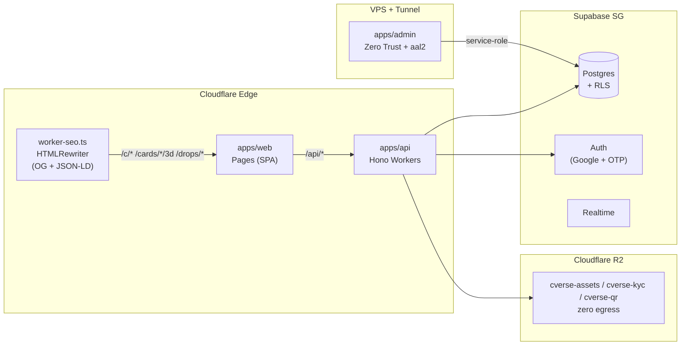

# C.Verse Platform — C.Card MVP

> **Creator Verse** — platform kartu koleksi kreator edisi terbatas (63×88mm, holo, acrylic, NTAG 424 TagTamper). Satu harga, satu kartu per orang, vault-first, provenance NFC.

[](#stack)
[](#angka-kunci)
[](#dokumen-canonical)
[](#prasyarat)

---

## Daftar Isi

- [Arsitektur](#arsitektur)
- [Quick Start](#quick-start)
- [Struktur Monorepo](#struktur-monorepo)
- [Fitur Inti](#fitur-inti)
- [Halaman & Route](#halaman--route)
- [C-Coin & Ekonomi](#c-coin--ekonomi)
- [Keamanan & Anti-Fraud](#keamanan--anti-fraud)
- [Deployment](#deployment)
- [Dokumen Canonical](#dokumen-canonical)
- [Konvensi](#konvensi)

---

## Arsitektur



- **Web publik** → Cloudflare Pages. SEO tanpa SSR: satu Worker di depan SPA inject `og:*` + `JSON-LD` + `sitemap.xml` dari `apps/api/src/routes/seo.ts`.
- **API** → Hono di Workers (lokal via `@hono/node-server`). Tanpa Supabase tetap jalan in-memory (`apps/api/src/lib/store.ts`). Storage: Cloudflare R2 (`wrangler.toml` `ASSETS`/`KYC`).
- **Admin** → Vite SPA terpisah di VPS + Cloudflare Tunnel + Access. Service-role only, 2FA TOTP (`aal2`), audit log append-only.

---

## Quick Start

### Prasyarat

| Tool | Versi |
|------|-------|
| Node | `>=20` |
| pnpm | `9.12.3` (`npm i -g pnpm@9.12.3`) |

> Jangan pakai `npm`/`yarn` — lockfile `pnpm-lock.yaml` v9.

### Install & Jalan

```bash
pnpm install

# Semua service (API :8787 + Web :5173)
pnpm dev

# Per app
pnpm --filter @c-verse/api dev:node   # Hono Node :8787
pnpm --filter @c-verse/api dev        # wrangler dev :8787 (Workers runtime)
pnpm --filter @c-verse/web dev        # Vite :5173  (proxy /api → :8787)
pnpm --filter @c-verse/admin dev      # Vite :3000  (127.0.0.1 only)

# Quality gates
pnpm run typecheck   # tsc --noEmit × 4 workspaces
pnpm run build       # shared + web/dist + admin/dist (api = tsc only)
pnpm run lint        # no-op
```

### Environment

Template per app — copy `<folder>/.env.example` jadi file lokal masing-masing:

| App | Copy dari | Jadi | Isi |
|---|---|---|---|
| `apps/web` | `apps/web/.env.example` | `.env.local` | `VITE_SUPABASE_*` (anon only), `VITE_TURNSTILE_SITE_KEY`, `VITE_ENABLE_DEMO_LOGIN` |
| `apps/admin` | `apps/admin/.env.example` | `.env.local` | `VITE_SUPABASE_*` (anon + MFA, di belakang Access) |
| `apps/api` | `apps/api/.env.example` | `.dev.vars` (dipakai Wrangler **dan** Node) | `SUPABASE_*`, `TURNSTILE_SECRET_KEY`, `NFC_MASTER_KEY`, `MIDTRANS_*`, `PAYOUT_WEBHOOK_SIGNING_KEY`, SMTP |

Secrets prod via `wrangler secret put` — tidak pernah di repo (CF_ACCOUNT_ID, CF_API_TOKEN, SMTP, Midtrans, NFC, payout key).

Tanpa Supabase: API otomatis pakai store in-memory + `ensureSeed()`.

Supabase lokal (opsional, DB only):

```bash
npx supabase start        # API :54321  DB :54322  Studio :54323
npx supabase db reset     # jalankan migrations/*.sql + seed.sql (DB saja)
```

Storage: Cloudflare R2 (`cverse-assets`, `cverse-kyc`, `cverse-qr` — `wrangler.toml` + `08_deployment.md` §3.4).

### Akun Demo

| Role | Email | Password | Catatan |
|------|-------|----------|---------|
| Kolektor | `demo@cverse.id` | `demo123` | 120 C-Coin, order + vault card |
| Admin | `admin@cverse.id` | `admin123` | butuh TOTP `aal2` di admin app |
| Kreator | `karina@creator.id` | `x` | 185k followers (seed) |

Tombol **Demo Login** 1-klik tersedia di `/login`.

---

## Stack

| Layer | Pilihan |
|-------|---------|
| Web publik | React 19 + Vite + React Router + TanStack Query + three.js → Cloudflare Pages |
| API | Hono 4 + Zod (`@hono/zod-validator`) → Cloudflare Workers |
| Admin | React 19 + Vite → VPS + Cloudflare Tunnel + Access (Zero Trust) |
| DB / Auth / Realtime | Supabase Postgres (SG) + pgcrypto |
| Storage | Cloudflare R2 — `cverse-assets` / `cverse-kyc` / `cverse-qr` · zero egress · `wrangler.toml` `ASSETS`/`KYC` |
| Shared | `packages/shared` — Zod schemas + constants canonical |
| Email | SumoPod SMTP (abstraction layer) + FCM push |
| Monorepo | pnpm workspaces + Turborepo |

Semua angka & enum canonical di `packages/shared/src/index.ts` — jangan hard-code di app.

---

## Struktur Monorepo

```
.
├── apps/
│   ├── api/                 # Hono Workers — /api/* + /sitemap.xml + /api/seo
│   │   ├── src/index.ts     # mount routes + CORS + /sitemap.xml delegate
│   │   ├── src/routes/      # auth, drops, orders, wallet, nfc, listings,
│   │   │                    # bids, browse, profile, publicProfile, shipments,
│   │   │                    # gamification, creators, kyc, seo
│   │   ├── src/lib/store.ts # in-memory store (mirror Supabase) + helpers
│   │   └── worker-seo gap?  # → apps/web/worker-seo.ts (edge)
│   ├── web/                 # Pages SPA — publik
│   │   ├── src/App.tsx      # routes (lihat tabel di bawah)
│   │   ├── src/pages/       # Landing, Drops, Checkout, CardInfo/3D, Wallet...
│   │   ├── src/lib/api.ts   # fetch wrapper + patchConsent()
│   │   └── worker-seo.ts    # HTMLRewriter edge worker
│   └── admin/               # VPS SPA — ADM-01..10 + Investor
├── packages/shared/         # single source: schemas + C_COIN_RATE_IDR + fee
├── supabase/
│   ├── migrations/
│   ├── seed.sql
│   └── config.toml
└── docs/                    # canonical 00_readme → 09_recommendations (VALIDATED)
```

---

## Fitur Inti

| # | Flow | Catatan |
|---|------|---------|
| 1 | **Primary drop** | 1 kartu/user/drop (atomik), `priceCcoin` canonical, `signedCount=ceil(n/10)`, `priceSigned=ceil(price*1.67)` |
| 2 | **Fulfillment** | `paid → qc → settled` (vault) vs `paid → qc → shipped → delivered → settled` (shipping) |
| 3 | **Settlement** | `wallet_transactions` append-only, escrow `held/released`, ledger idempotent (`metadata.idempotency_key`) |
| 4 | **NFC Tap → 3D** | SUN URL `c-verse.co/cards/:id/3d?uid&ctr&c=CMAC` → badge `Verified Card`; iOS background reading (tanpa Web NFC) |
| 5 | **QR Fallback** | Scan dus → `/cards/:id` status `Registered` (tanpa CMAC) |
| 6 | **Ownership** | `current_owner_id` + `ownership_history`; `location` ∈ `platform_stock/with_owner/platform_vault` |
| 7 | **Secondary** | Marketplace (buyout `cards.buyout_price_ccoin`) + Browse (bid langsung, 1 active tertinggi, outbid/cancel release, owner accept only) |
| 8 | **Ship-from-vault** | Kartu di vault bisa dikirim kapan saja (`POST /api/orders/vault-shipout`, ongkir integer ≥1) |
| 9 | **Gamifikasi** | `level=floor(total_xp/10)`, `spend 1 C = 1 XP` + `xp_reward` badge; **top-up tidak menambah XP** |

---

## Halaman & Route

### Publik (tanpa login)

| Route | Halaman | Kunci |
|-------|---------|-------|
| `/` | Landing | hero + drop terbaru |
| `/drops` | Katalog | grid + filter kreator |
| `/drops/:id` | Detail drop | countdown + harga C-Coin |
| `/marketplace` | Marketplace | kartu dengan buyout |
| `/browse` | Browse | cari + bid langsung (`?sort=unit_number`) |
| `/cards/:cardId` | Info kartu | sertifikat + ownership history |
| `/cards/:cardId/3d` | 3D viewer | simple + badge Verified (hanya via NFC tap) |
| `/leaderboard` | Peringkat | F019 |
| `/c/:username` | Kreator publik | handle + bio + link sosmed + list drop (tanpa follower) |
| `/u/:username` | Kolektor publik | hidden jika `privacy anonymous` |
| `/sitemap.xml` | Sitemap | dinamis (drops + creators + cards) |

### User (login)

| Route | Halaman |
|-------|---------|
| `/home` | Home |
| `/drops/:id/checkout` | Checkout (vault default, opsi shipping + ongkir) |
| `/orders` · `/orders/:id` | Daftar & timeline (tracking hanya untuk shipping) |
| `/wallet` | Saldo + ledger + top-up (cap 1000 C) + payout (min 10 C, fee 1%) — disclosure Opsi A |
| `/collection` · `/me` | Koleksi + level/badge |
| `/me/manage` | Kelola kartu — buyout, bid accept, ship-from-vault |
| `/me/privacy` | `is_anonymous` + 2 consent toggles |
| `/me/kyc` | KTP/NIK/alamat (hanya untuk payout) |
| `/creator` | Traffic + pendapatan (platform-produced 70/30) |
| `/notifications` | In-app |

### Admin (terpisah — `admin.c-verse.co`)

| Route | ADM | Deskripsi |
|-------|-----|-----------|
| `/` | — | Ringkasan ops |
| `/creators` | ADM-01 | CRUD kreator (off-platform) |
| `/drops` | ADM-02 | Buat/publish drop |
| `/orders` | ADM-03 | Fulfillment + resi |
| `/nfc` | ADM-04 | Batch + QC kartu |
| `/payouts` | ADM-05 | Escrow + rekonsiliasi |
| `/disputes` | ADM-06 | Mediasi |
| `/badges` | ADM-07 | Badge (criteria + ikon + XP reward) |
| `/audit` | ADM-08 | Append-only, retensi ≥1 th |
| `/investor` | ADM-10 | GMV · users · drops · secondary (bukan publik) |

2FA TOTP (`aal2`) wajib sebelum UI privileged terbuka. Tanpa Supabase → mode demo read-only.

---

## C-Coin & Ekonomi

| Parameter | Nilai | Sumber |
|-----------|-------|--------|
| Rate | **1 C-Coin = Rp 10.000** (ceiling dari IDR) | `C_COIN_RATE_IDR` |
| Nominal | **integer ≥ 1**, tanpa desimal (`CHECK x >= 1`) | `packages/shared` |
| Cap saldo | **1000 C** (≈ Rp 10 jt) | `BALANCE_CAP_CCOIN` (07 C-08) |
| Min payout | **10 C** (Rp 100 rb), fee **1%** | `MIN_PAYOUT_CCOIN` |
| Primary | **70/30** platform/creator (platform-produced; creator-produced defer Y2+) | `REVENUE_SHARE_PLATFORM_PRODUCED` |
| Secondary | **15%** total = 7.5 platform + 7.5 royalti lifetime + 85 seller | `SECONDARY_*_PCT` (snapshot di `metadata`) |
| KYC | **hanya** payout/disbursement + akumulasi top-up besar. **Tidak** untuk pasang buyout/accept bid | 07 C-05b (validasi lawyer) |
| Domain | `c-verse.co` (primary, **LOCK sebelum NFC**) + `c-verse.id` redirect | 06/08 |

> Struktur Opsi A **closed-loop buyer**: saldo buyer tidak dapat diuangkan (withdraw). Hanya hasil penjualan seller/kreator yang di-disburse ke IDR. Refund = reversal ke metode asal.

---

## Keamanan & Anti-Fraud

Status implementasi per item (`[done]` = ada di code + test; `[spec NN]` = spec docs/NN siap, eksekusi bertahap).

- **Auth Supabase (JWT + Turnstile)** — Google OAuth + email OTP 6 digit; API verify JWKS `jose`. `[done — docs/10]` (aktifasi provider Google/Turnstile = config dashboard).
- **RLS default-deny** — matriks policy per tabel + guard trigger (buyout-only update, ledger & audit append-only). `[done — docs/11]` (verifikasi `supabase/tests/rls_test.sql` butuh Docker).
- **NFC CMAC (SUN AN12196)** — AES-CMAC RFC 4493 + anti-replay counter + tamper permanen. `[done — docs/12]` (provisioning tag fisik = ops TapLinx).
- **Atomic money RPC** — wallet/checkout/raffle/bid/buyout single-transaction + idempotency ledger. `[done — docs/13]` (route read-only masih gelombang migrasi; store.ts dev fallback).
- **Payments Midtrans** — Snap top-up + webhook signature + payout disbursement. `[done — docs/14]` (sandbox keys + e2e = ops; gate C-08 sebelum uang riil).
- **Rate limit** — 10 bid aktif/user, 50 bid/hari. `[done]`
- **Wash trading** — cooling **14 hari** (`docs/05 I13`, `07 C-12`). `[done]`
- **Creator self-dealing** — larang beli kartu drop sendiri **30 hari** (`I14`, `C-13`). `[done]`
- **Buyout guard** — max **20** kartu buyout aktif/user (`I10`). `[done]`
- **Idempotency** — `metadata.idempotency_key` unique index + RPC `ON CONFLICT`. `[done]`
- **Hold payout** — `wallets.hold_payout_until` + helper `isPayoutHeld()` (fraud hold). `[done]`
- **Fee snapshot** — `fee_rate_platform/royalty/seller` disimpan per transaksi. `[done]`
- **Consent** — `consent_analytics_detail` + `consent_data_market` (`PATCH /api/profile/consent`, UI di `/me/privacy`). `[done]`
- **Creator views** — `creator_page_views` log dari day 1 (`GET /api/creators/:id?stats=1`). `[done]`

---

## Deployment

| Target | Sumber | Cara |
|--------|--------|------|
| Web | `apps/web/dist` | Cloudflare Pages (`pnpm --filter @c-verse/web build`) |
| API | `apps/api` | `wrangler deploy` (Workers) · cron: escrow 5m, payout Selasa 06:00 WIB, badge 03:00 WIB |
| Admin | `apps/admin/dist` | VPS + `cloudflared tunnel` → `admin.c-verse.co` + Access *Allow founders* |
| DB | `supabase/` | `npx supabase db reset` (migrasi + seed) · RLS default-deny (docs/11) |

**Go-live checklist** (08): SSL aktif, `/health` OK, NFC verify di device nyata, RLS tanpa leak `service_role`, secret tidak di bundle, email terkirim, cron OK, T&C + cap saldo live sebelum top-up uang riil.

---

## Dokumen Canonical

Semua keputusan terkunci di `docs/` — baca urut untuk onboarding tanpa perlu buka `00_Dream_Project/`:

| # | File | Isi |
|---|------|-----|
| 00 | `00_readme.md` | Orientasi + glossary + angka kunci |
| 01 | `01_scope.md` | MoSCoW + RICE + ADM-01..10 |
| 02 | `02_pages.md` | Sitemap per role + SEO Worker |
| 03 | `03_flows.md` | 9 flow end-to-end + gate |
| 04 | `04_user_stories.md` | Given/When/Then |
| 05 | `05_data_model.md` | Skema logis + invariant I1..I14 |
| 06 | `06_tech_decisions.md` | Full-edge stack + D1..D7 |
| 07 | `07_constraints.md` | Gate legal & operasional |
| 08 | `08_deployment.md` | Runbook step-by-step |
| 09 | `09_recommendations.md` | Build-time implications (fee, numbering, consent) |

Angka kanonik ada di `docs/00_readme.md` §4 **dan** `packages/shared/src/index.ts` — keduanya harus sinkron.

---

## Konvensi

- **ESM only**, `strict: true`, `moduleResolution: bundler`.
- API pakai `Hono` + `zValidator` dengan schema dari `@c-verse/shared` → `app.route("/api/<name>", module)`. Import via alias `@c-verse/shared`, jangan relative.
- **C-Coin integer** — jangan ubah kolom ke `numeric`; `idrToCCoin = Math.ceil`.
- **Vault-first** — `platform_vault` adalah default; ship-from-vault kapan saja.
- **No auction timer** di MVP (defer — 07 C-07).
- **Admin tidak di edge** — service-role + Access + aal2 + audit log. Tidak ada route admin di API publik.

---

<p align="center">
  <sub>C.Verse — Koleksi Kreator Edisi Terbatas · c-verse.co · vault-first · provenance NFC</sub>
</p>
